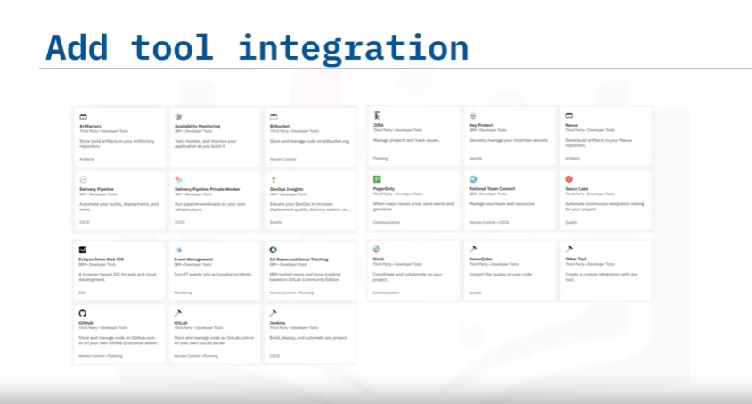

# Introduction to a DevOps Approach

## Objectives

After watching this video, you will be able to:

- Describe DevOps
- Explain when and why to implement DevOps
- List some of the DevOps services on IBM Cloud

## What is DevOps?

> the term DevOps comes from merging the words development and operations.

- Software Development.
- Computer Operations.

> Before DevOps, there were two teams that were responsible for code delivery.
> the Development Team and the Operations Team.

- The Development Team - designed the code, delivered the new features,fixed bugs,
  and tested the code.
- The Operations Team - deployed the code to the different environments, maintained the uptime on production , and diagnosed failures.

## Implementing DevOps

- Automation
- - Build process
- - Code testing
- - Deployment to the different environments
- - Monitoring
- Developers actively and continously
- - Keep the automation, pipelines, and other entities up to date
- - Make improvements
- - Develop code

> With DevOps, both team work together to support the software lifecycle, from code design to deployment to production.
> You can use DevOps processes and tools to automate the build process, code testing, deployment to the different environments, and monitoring.
> Developers actively and continuously perform task to keep the automation, pipelines, and other entities in this realm up to date and even improve them, as well as develop code.

## DevOps provides many Benifits:

- You can work from code to production in minutes.
- Work on your own or use the collaboration tools to work with a team.
- In minutes, you can go from source code to a running app.
- Accelerate app delivery
- Innovate like a startup, and scale for the enterprise.
- You can host an open source project, run a hackathon, or start a skunkworks project.
- DevOps code is continously delivered and intergrated into the main shared repository.
- Deploy with confidense:
- Leverage the repeatability of the process by using automation to ensure that the same steps are executed every time you deploy.
- Leverage automated testing as a quality gate before deploying code to a specific environment, or in some cases, to enable the monitoring or testing of the code in a live environment.

The IBM Cloud Catalog provides services to enable end-to-end DevOps, such as Auto-scaling, Monitoring, and Continous Delivery.

# Summary

- DevOps is a software methodology that integrates application development and IT operations.
- You can use DevOps tools to automate the build process, code testing, deployment, and monitoring.
- The IBM Cloud Catalog provides services to enable end-to-end DevOps such as Continous Delivery.

<!------------------------------------------------------------------------------------>

# IBM Cloud Continous Delivery Overview

## Objectives

- Describe Continuous Delivery and DevOps on IBM Cloud
- Describe Continous Delivery Tools.

## What is Continuous Delivery?

- An IBM Cloud service that support your DevOps workflows to build, test, and deliver applications.
- - **DevOps**: Create open integrated toolchains
- - > to enable tool integrations that support your development, deployment, and Operations tasks.
- - **Web IDE**: Develop, edit, and push code.
- - > Edit and push your code from anywhere by using the web-based IDE.Create, Edit, run, and debug code, and complete source-control tasks in GitHub.
- - > Seamlessly move from editing your code to deplopying it to production.
- - **Git repo** and **issue tracker**: Collaborate with your team.
- - > Collaborate with your team and manage your source code with a Git repository(repo) and issue tracker.Manage Git repos through fine-grained access controls that keep code secure.
- - **Delivery pipelines**: Use automated pipelines to deliver continuously.
- - > Deliver continuously by using automated pipelines.Automate builds,unit tests, and deployments and be ready to release into production at any time.

A **_toolchain_** is a set of tool integrations that support development, deployment,and operations tasks.

- Development
- Deployment
- Operations
  > **Toolchains** can include open source tools,IBM Cloud services such as IBM Cloud DevOps Insights, and third-party tools such as GitHub,PagerDuty, and Slack.
  > You can use a toolchain collaboratively and make operations repeatable and easier to manage.

### **3 Continouos Delivery Tool**

**_WEB IDE_**

- > **_WEB IDE_** - you can develop code such as **Node.js**, **Java**, or **other languages**.
- > No software other than your browser is necessary.
- > **Web IDE** saves your current work in a cloud-based file directory, which is known as the local repository.
- > You can also configure the build, deploy, or test scripts within Web IDE.
- > IBM Cloud provides Eclipse Orion as the Web IDE.
- > You can also use a desktop IDE with DevOps services.

**_Git Repo_**

- > for source control management (SCM) and issue tracking, Continuous Delivery creates a **Git repo** as a change management system.
- > The local repositoryis a copy of your latest edits before you submit your work to the SCM system.
- > The **Git Repo**, which is the remote repository, is hosted on the IBM Cloud DevOps infrastructure.
- > The issue tracker tracks your work including defects,enhancements, and tasks.
- > The issue tracker is hosted by IBM and built on GitLab Community Edition.
- > Track issues and share ideas through the issue tracker.
- > Review code and enhance collaboration through merge request.
- > Document projects on the wiki system.

**_Delivery Pipeline_**

- > The Delivery Pipeline tool automates the process of building and deploying your code as an IBM Cloud application.
- > Build, test, and deploy in a repeatable way with minimal human intervention.

# Summary

- With Continous Delivery you can:
- - Create integrated DevOps open toolchains
- - Develop, edit, and push code from anywhere
- - Collaborate with your team and manage your source code with a Git repo and issue tracker
- - Deliver continuously via automated pipelines

- A toolchain is a set of tool integrations that support development, deployment, and operations tasks.

<!------------------------------------------------------------------------------------>

# Creating IBM Cloud Continuous Delivery Toolchains.

## Objectives

- Explain how to create the IBM Cloud Continuous Delivery service.
- Explain how to add Continuous Delivery toolchains to your project.
- Explain how to add various tools to leverage the toolchain.

To add Continuos Delivery to your application, complete the following steps
<ol>
<li>First, in the IBM Cloud dashboard, select Continuous Delivery</li>

<li>Select the region closest to you and select a price plan.(the *free Lite plan* is the default selection)</li>

<li>Optionally, update the service name</li>
<li>Now, to create the service instance, click Create</li>
<li>When you create the service, The Getting Started page appears</li>

<li>To add your first toolchain here, click Create a Toolchain</li>
<li>You can also add a toolchain from the catalog</li>

<li>Another way would be to add a toolchainto an existing application by enabling Continous Delivery</li>

<li>You can create a toolchain from a template or build one from scratch by enabling an application for continous delivery</li>
<li>The toolchain will use the Continous Delivery service under the covers</li>
<li>Depending on how the toolchain was created, it might contain some preconfigured tools.</li>
<li>You can add additional tools by selecting Add Tool</li>

</ol>

## Create Continouos Delivery ToolChains

The user interface (UI) to create a toolchain groups the tools into the following four phases.

**THINK** - is for planning the application by creating bugs, tasks, or ideas using the Git repo issue tracker

**CODE** -  is for implementing the application by providing a GIT repo as an SCM system and a WEB IDE to edit your code online.
- In the repository, you can specify whether to clone a repository or start fro scratch by selecting New in the repository type.

**DELIVER** - is for configuring the delivery pipeline.
- it allows you to specify automatic build, deployment, and testing of your code after a developer pushes new code to the Git repo.

**RUN** -  is for running the application in the IBM Cloud environment.

## Add Tool Integration

- The collective power of the toolchain is great than the sum of its individual tool integrations.
- In the tool integration section, select each tool integration that you want to configure for your toolchain.

Consider the following examples:

- if you configure the **Sauce Labs**,the toolchain is set up to enable adding Sauce Labs, which you can use to add test jobs to the pipelines.
- if you configure **PagerDuty**, that toolchain is set up to send alert notification to the specified PagerDuty service when a major issue occurs.
- if you configure **Slack**, the toolchain is set up to send notifications to the specifed Slack channel
- if you configure **GitHub** for source code tool integration, the sample repo can be cloned or forke,for example, into your GitHub account.

# Summary

- You can enable Continuous Delivery from the IBM Cloud dashboard
- Continuous Delivery toolchains group the tools into the following four phases:
- - THINK
- - CODE
- - DELIVER
- - RUN

<!------------------------------------------------------------------------------------>

# Web IDE Features

## Objectives

- Describe editing code features in the Web IDE
- Run an application from the Web IDE
- Debug the Node.js application from the Web IDE

## WEB IDE: Edit Code Features
* Web IDE
- - Eclipse Orion
- - No installations, just start coding now

> The Web IDE features in Continuous Delivery provide the following capabilities:
> IBM Cloud uses Eclipse Orion Web IDE.
> No installations are required.
> You can use a browser to code.
> it's a full-featured IDE